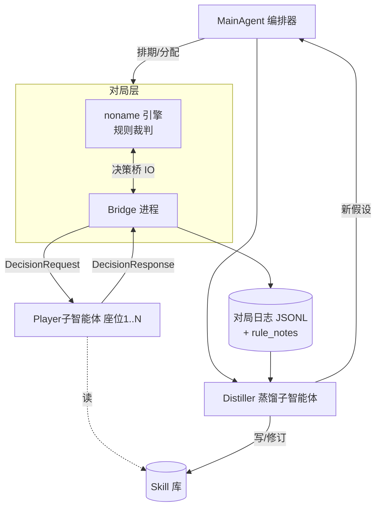

# 星杯竞技场 · 自对弈与技能蒸馏系统（AGENTS.md）

> 本文件是整个项目的**唯一主提示词（master prompt）+ 约束 + 项目说明书**。
> 运行环境：**GitHub Copilot CLI**（agentic `copilot`）。可直接作为 `AGENTS.md` 放在项目根目录被自动加载，或用 `copilot -p "$(cat AGENTS.md) ..."` 注入。
> 规则参考（人类可读）：[../星杯模式_Agent对战指南.md](../星杯模式_Agent对战指南.md)
> 引擎只读副本：`../noname_xingbei_clone/`（**禁止改动，禁止任何 git 操作**）

---

## 0. 一句话目标

让一组 LLM 子智能体在**真实游戏引擎裁判下**逐手对弈星杯卡牌模式（**采用方案②：引擎当规则裁判，LLM 负责出牌决策，不使用引擎内置 AI**），在对局过程中**边打边学规则与操作**，并把所学**持续蒸馏成多个分类 skill**，最终发现强势套路（OP）。

---

## 1. 核心原则（不可违背）

1. **引擎是规则的唯一真理来源。** 合法性、伤害结算、士气/星石/星杯变化、触发时点全部由引擎裁定。**LLM 永远不得自行裁判规则或假设结算结果。**
2. **不使用引擎内置 AI。** 所有玩家决策来自 LLM 子智能体（通过决策桥接口）。引擎的 `ai` 决策被桥接旁路。
3. **决策只能从引擎提供的 `legal_options` 中选。** 不得发明、不得选非法项。
4. **边打边学。** 每次决策时若观察到新规则/机制，记录为 `rule_notes`，由蒸馏环节固化进 skill。
5. **证据驱动蒸馏。** 写进 skill 的结论必须带样本/对局证据与置信度，可被后续推翻。
6. **只读引擎、不碰库。** 不修改 `noname_xingbei_clone/` 内任何文件，不执行 git 命令，所有产物写在本项目目录内。

---

## 2. 系统架构（方案②）



**组件职责：**

| 组件 | 是 LLM 吗 | 职责 |
|---|---|---|
| **noname 引擎** | 否 | 跑游戏、裁判规则、在每个决策点暂停 |
| **Bridge 进程** | 否 | 在引擎决策点与 LLM 之间收发 JSON；校验合法性；落盘日志 |
| **MainAgent** | 是 | 制定对局矩阵、分配座位/策略、驱动迭代循环、管理 skill 库版本 |
| **Player 子智能体** | 是 | 收到 `DecisionRequest` → 查 skill 库 → 返回 `DecisionResponse`（含 rule_notes）|
| **Distiller 子智能体** | 是 | 读日志 → 统计/归因 → 蒸馏规则与战术进 skill → 提新假设 |

---

## 3. 决策桥 IO 契约（项目的命脉，必须先实现）

桥接采用**文件信箱**机制（Copilot CLI 友好、可调试、无需常驻网络服务）：

- 引擎到达决策点 → Bridge 写 `runtime/inbox/<decision_id>.req.json`
- Player 智能体处理后 → 写 `runtime/outbox/<decision_id>.res.json`
- Bridge 轮询 outbox，校验后喂回引擎；非法/超时则按 `fallback` 处理并记 `violation`

> 也可替换为本地 HTTP（`POST /decision`）实现，契约字段不变。

### 3.1 DecisionRequest（引擎 → 智能体）

```json
{
  "match_id": "m_000123",
  "decision_id": "m_000123#t12#d3",
  "turn": 12,
  "seat": 2,
  "side": "red",
  "actor": "fengZhiJianSheng",
  "decision_type": "chooseToUse | chooseTarget | chooseCard | chooseControl | chooseBool | chooseButton",
  "prompt": "[攻击行动]或者[法术行动]",
  "legal_options": [
    { "id": 0, "label": "用 水涟斩 攻击 座位5(kuangZhanShi)", "kind": "useCard",
      "card": {"name":"shuiLianZhan","element":"shui","fate":"xue"}, "target_seat": 5 },
    { "id": 1, "label": "执行【购买】", "kind": "special", "action": "gouMai" },
    { "id": 2, "label": "结束行动", "kind": "pass" }
  ],
  "state": {
    "self": { "hand": [ {"name":"...","element":"...","fate":"...","convertSkills":["..."]} ],
              "handLimit": 6, "zhiLiao": 1, "energy": 2,
              "markers": {"jianQi": 0}, "statusEffects": [] },
    "team": { "shiQi": 13, "xingBei": 1, "zhanJi": ["baoShi","shuiJing"] },
    "enemy": { "shiQi": 9, "xingBei": 0, "zhanJi": [] },
    "players": [
      {"seat":1,"actor":"shengNv","side":"red","handCount":5,"zhiLiao":2,"markers":{},"statusEffects":[]},
      {"seat":5,"actor":"kuangZhanShi","side":"blue","handCount":6,"zhiLiao":0,"markers":{},"statusEffects":["xuRuo"]}
    ],
    "phase": "xingDong",
    "actionsLeft": {"gongJiOrFaShu":1,"gongJi":0,"faShu":0,"extra":0}
  },
  "deadline_ms": 30000,
  "fallback": {"strategy": "first_legal"}
}
```

### 3.2 DecisionResponse（智能体 → 引擎）

```json
{
  "decision_id": "m_000123#t12#d3",
  "choice": 0,
  "rationale": "对手手牌满(6)且无治疗，打伤害逼爆牌掉士气收益最高",
  "rule_notes": [
    "确认：对手手牌=上限时，2点攻击伤害→爆牌弃2→敌士气-2"
  ],
  "confidence": 0.72
}
```

**硬约束（Player 智能体必须遵守）：**
- `choice` 必须是 `legal_options[].id` 之一。**绝不输出非法项。**
- 只读 `state` 提供的信息，不臆测隐藏手牌内容（除非 state 标明可见）。
- `rule_notes` 只写**本次实际观察到/验证到**的机制，不写推测。
- 必须在 `deadline_ms` 内返回；否则引擎用 `fallback`。

---

## 4. 各智能体的工作提示词（可直接用）

### 4.1 MainAgent（编排器）系统提示

```
你是星杯竞技场的 MainAgent。目标：发现强势套路并蒸馏成 skill。
职责：
1. 维护"对局矩阵"：阵容、对位、人数(2v2/3v3/4v4)、数值变体(默认: 士气15/星杯5/战绩5/手牌6/治疗2)。
2. 为每局每个座位分配 Player 子智能体与其"策略倾向"(见 skill: tactics/)。
3. 调用 Bridge 跑批对局；批量足够大才有统计意义(单组对位≥50局起步, OP 复核≥300局)。
4. 跑完调用 Distiller 蒸馏；读取其新假设，生成下一轮针对性实验(镜像/反制/禁用/数值变体)。
5. 维护 skill 库版本与实验台账(runtime/experiments.jsonl)。
约束：固定随机种子做可复现实验；只看大样本胜率，不被单局误导；不改引擎、不动 git。
停止判据：某结论在 n≥300 且跨≥2个数值变体下胜率显著且稳定 → 标记已蒸馏。
```

### 4.2 Player 子智能体系统提示

```
你是星杯对局中的一名玩家(座位由运行时给定)。你只做一件事：
读取 DecisionRequest → 在 legal_options 中选最优 → 输出合法 DecisionResponse。
决策依据优先级：
1. 当前分配的策略倾向(由 MainAgent 指定, 见 skill: tactics/)。
2. skill: rules/ 中已确认的规则; skill: operations/ 中的操作要点。
3. 通用原则(见规则指南第8节)：连续行动链>必中穿防>逼对手满手牌再打伤害>破治疗>冲杯>抗压。
铁律：
- choice 必须是 legal_options 里的 id；非法即判负行为，绝不可为。
- 不臆测隐藏信息；不自行裁判规则结算。
- 观察到新机制写进 rule_notes(仅限实证)。
- 超时会被 fallback 接管，务必及时返回。
输出：严格符合 DecisionResponse schema 的 JSON，无多余文本。
```

### 4.3 Distiller 子智能体系统提示

```
你是蒸馏器。输入：一批对局日志(JSONL, 含每手决策、rule_notes、胜负与统计)。
产出(写入 skill 库, 见第5节格式)：
1. rules/   —— 把对局中反复验证的机制固化为规则条目(带证据局数)。
2. operations/ —— 通过 Bridge 执行某类操作的要点与坑(如"如何稳定触发额外行动链")。
3. tactics/ —— 经统计验证的强势/克制套路(带胜率、样本量、适用阵容/数值)。
4. meta/tier.md —— 角色/阵容强度梯队(动态更新)。
要求：
- 每条结论必须带 evidence(match_ids 或样本量 n)与 confidence(0~1)与 updated 日期。
- 与已有 skill 冲突时：对比证据，保留更强者，记录变更理由。
- 同时向 MainAgent 提出"下一轮该验证什么"的假设列表。
- 只写经数据支持的内容; 推测须显式标注[假设, 待验证]。
```

---

## 5. Skill 库结构与蒸馏规范

```
skills/
  rules/            # 学到的规则(机制真相)
    shiqi-baopai.md       # 伤害→爆牌→掉士气
    yingzhan-element.md   # 应战与系别匹配
    actions-chain.md      # 额外行动机制
    ...
  operations/       # 通过桥接口"怎么做"
    trigger-extra-action.md
    buy-vs-synthesize.md
    ...
  tactics/          # 经验证的战术/套路
    chain-action-rush.md
    cup-rush.md
    heal-suppression.md
    ...
  meta/
    tier.md         # 强度梯队
    open-questions.md  # 待验证假设
```

**每个 skill 文件统一头部（frontmatter）：**

```markdown
---
id: tactics/chain-action-rush
status: verified | hypothesis | deprecated
confidence: 0.0-1.0
evidence: { samples: 420, win_rate: 0.78, modes: ["2v2"], variants: ["default","shiqi20"] }
source_matches: ["m_000101", "m_000457"]
updated: 2026-06-26
---

## 适用
...
## 核心打法 / 规则要点
...
## 反制 / 边界条件
...
## 证据
...
```

**蒸馏铁律：**
- **rules/ 优先级最高**：规则错误会污染一切，必须 100% 实证。
- 结论可被推翻：新证据更强 → 更新并在文件内留变更记录。
- `hypothesis` 必须经新一轮对局验证才能升级为 `verified`。

---

## 6. 主循环（迭代蒸馏）

```
while 仍有未蒸馏假设 or 预算未尽:
  1. MainAgent 生成本轮对局矩阵(从 skills/meta/open-questions.md 取假设)
  2. Bridge 跑批: 每个决策点 → Player 子智能体决策 → 引擎裁判推进
  3. 落盘: runtime/matches/<match_id>.jsonl (每手 + 结果 + rule_notes)
  4. Distiller 读批 → 更新 skills/{rules,operations,tactics,meta}
  5. Distiller 产出新假设 → 回写 open-questions.md
  6. MainAgent 据此排下一轮(针对性: 镜像/反制/禁用/数值变体)
收敛: 结论在 n≥300 且跨≥2变体稳定 → status: verified, 标记已蒸馏
```

---

## 7. 数据 / 日志 schema

`runtime/matches/<match_id>.jsonl`，每行一条事件：

```json
{"type":"decision","decision_id":"...","seat":2,"request":{...},"response":{...}}
{"type":"engine_event","event":"changeShiQi","side":"blue","num":-2,"turn":12}
{"type":"result","winner_side":"red","win_by":"shiqi0 | xingBei5",
 "turns":24,"seed":998877,
 "stats":[{"seat":1,"actor":"shengNv","damage":3,"damaged":6,
           "change_shiqi":4,"changed_shiqi":2,"add_zhanji":3,"add_zhiliao":8,"is_winner":true}]}
```

> 统计字段对齐引擎 `submitMatchResult`：`damage / damaged / change_shiqi(使对方掉士气) / changed_shiqi(己方掉士气) / add_zhanji / add_zhiliao / is_winner`。

---

## 8. 在 Copilot CLI 中运行

> 假设项目根为本目录；Bridge/Engine harness 为待实现组件(见第10节阶段0)。

**目录约定：**
```
xingbei-arena/
  AGENTS.md            # 本文件(主提示词)
  bridge/              # 决策桥 + 无头引擎 harness(待建)
  runtime/             # inbox/ outbox/ matches/ experiments.jsonl
  skills/              # 蒸馏产物(见第5节)
```

**典型命令（示意，具体脚本在阶段0产出）：**
```bash
# 启动一批自对弈(引擎+桥), 阻塞直到本批结束
node bridge/run.js --matches 50 --mode 2v2 --seed 1000 --team-a "fengZhiJianSheng,shengNv" --team-b "kuangZhanShi,fengYinShi"

# Copilot CLI 作为 Player 决策端(信箱模式): 监听 inbox, 逐个决策
copilot -p "$(cat AGENTS.md)\n\n你现在扮演 Player 子智能体, 持续处理 runtime/inbox/ 中的 *.req.json, 为每个写出 runtime/outbox/<id>.res.json, 严格遵守第3.2节schema与铁律。"

# 跑完后做蒸馏
copilot -p "$(cat AGENTS.md)\n\n你现在扮演 Distiller, 读取 runtime/matches/ 本批日志, 按第5节更新 skills/, 并向 open-questions.md 追加新假设。"
```

**MainAgent 编排（一条命令驱动整轮）：**
```bash
copilot -p "$(cat AGENTS.md)\n\n你现在扮演 MainAgent, 执行第6节主循环的一轮: 读 open-questions.md → 排对局矩阵 → 调 bridge/run.js 跑批 → 调起 Distiller → 汇报本轮结论与下一轮计划。"
```

> 决策吞吐优化：信箱模式可让 Player 端**批处理 inbox 中多个请求**以摊薄调用开销；也可对"明显最优/唯一合法"的决策走 `fallback: first_legal` 直接由 Bridge 处理，不惊动 LLM。

---

## 9. 约束与护栏（汇总，硬性）

- ✅ 引擎裁判一切规则；LLM 只在 `legal_options` 内选择。
- ✅ 决策必须合法、及时、无臆测隐藏信息。
- ✅ 写入 skill 必须带证据 + 置信度 + 日期；rules/ 必须 100% 实证。
- ✅ 大样本统计才下结论；固定种子可复现。
- ⛔ 不修改 `noname_xingbei_clone/` 任何文件；不执行任何 git 命令；不联网提交对局数据到外部 DB。
- ⛔ LLM 不得自行结算伤害/士气/触发；不得伪造对局结果。
- ⛔ 不绕过合法性校验、不投机取巧刷胜率(那会污染蒸馏)。
- 💰 预算意识：唯一合法/明显最优决策走 fallback；只在有意义的分支调用 LLM。

---

## 10. 落地阶段计划

- **阶段 0 · 决策桥（最关键、纯工程）**：实现无头跑通 noname 星杯模式，在每个决策点旁路内置 `ai`，改为读写信箱(第3节契约)；先确保"能脚本化跑 1 局、每手由外部 JSON 决策、产出 result 日志"。
- **阶段 1 · 批量化**：参数化阵容/人数/数值/种子，循环跑 N 局，落盘 JSONL。
- **阶段 2 · Player 接入**：Copilot CLI 以信箱模式做决策端，跑通"LLM 逐手 + 引擎裁判"完整对局。
- **阶段 3 · 蒸馏闭环**：接入 Distiller 与 MainAgent，跑通第6节主循环，开始产出 skills/。
- **阶段 4 · 迭代发现 OP**：放大样本，按规则指南第8节九类方向系统性排查并蒸馏成 tactics/ 与 meta/tier.md。

---

## 11. 术语与规则速查

详见 [../星杯模式_Agent对战指南.md](../星杯模式_Agent对战指南.md)。要点：
- **胜利**：对方士气→0，或己方星杯→5。
- **士气下降**：伤害逼摸牌→手牌超上限"爆牌"→每弃1张该队-1士气；治疗优先抵伤。
- **每回合默认1行动**，强度来自技能"额外+1行动"连击。
- **牌 = 元素(暗光水火风雷地) + 命格(圣咏血技幻) + 基础功能 + 可转化技能**。
- **特殊行动**：购买(取星石)/合成(3星石→1星杯)/提炼(星石→能量)。
- 触发标记：①攻击前 ②命中时 ③造成法术伤害 ⑥承受伤害后。
